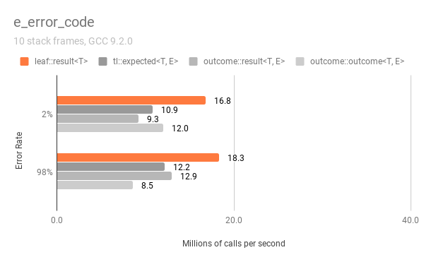
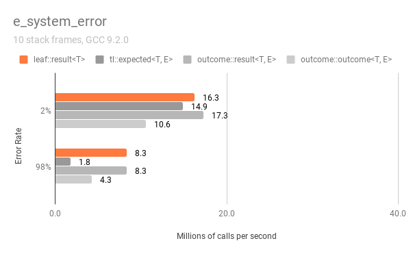
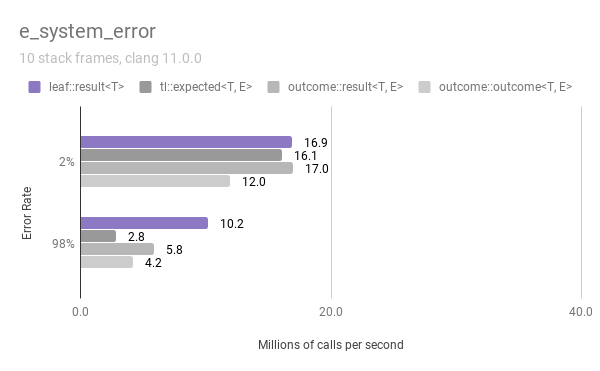
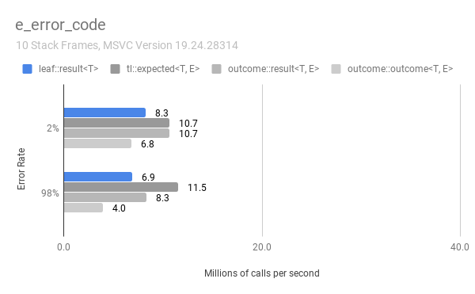
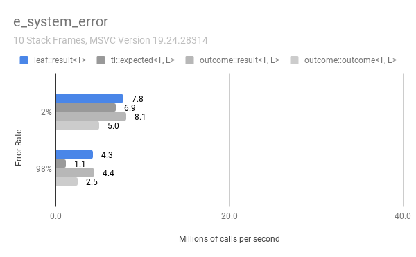
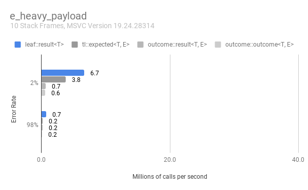

# Benchmark

The LEAF github repository contains two similar benchmarking programs, one using LEAF, the other configurable to use `tl::expected` or Boost Outcome, that simulate transporting error objects across 10 levels of stack frames, measuring the performance of the three libraries.

Links:
* LEAF: https://boostorg.github.io/leaf
* `tl::expected`: https://github.com/TartanLlama/expected
* Boost Outcome V2: https://www.boost.org/doc/libs/release/libs/outcome/doc/html/index.html

## Library design considerations

LEAF serves a similar purpose to other error handling libraries, but its design is very different. The benchmarks are comparing apples and oranges.

The main design difference is that when using LEAF, error objects are not communicated in return values. In case of a failure, the `leaf::result<T>` object transports only an `int`, the unique error ID.

Error objects skip the error-neutral functions in the call stack and get moved directly to the the error-handling scope that needs them. This mechanism does not depend on RVO or any other optimization: as soon as the program passes an error object to LEAF, it moves it to the correct error handling scope.

Other error-handling libraries instead couple the static type of the return value of *all* error-neutral functions with the error type an error-reporting function may return. This approach suffers from the same problems as statically-enforced exception specifications:

* It's difficult to use in polymorphic function calls, and
* It  impedes interoperability between the many different error types any non-trivial program must handle.

(The Boost Outcome library is also capable of avoiding such excessive coupling, by passing for the third `P` argument in the `outcome<T, E, P>` template a pointer that erases the exact static type of the object being transported. However, this would require a dynamic memory allocation).

## Syntax

The most common check-only use case looks almost identically in LEAF and in Boost Outcome (`tl::expected` lacks a similar macro):

```c++
// Outcome
{
  BOOST_OUTCOME_TRY(v, f()); // Check for errors, forward failures to the caller
  // If control reaches here, v is the successful result (the call succeeded).
}
```

```c++
// LEAF
{
  BOOST_LEAF_AUTO(v, f()); // Check for errors, forward failures to the caller
  // If control reaches here, v is the successful result (the call succeeded).
}
```

When we want to handle failures, in Boost Outcome and in `tl::expected`, accessing the error object (which is always stored in the return value) is a simple continuation of the error check:

```c++
// Outcome, tl::expected
if( auto r = f() )
{
  auto v = r.value();
  // No error, use v
}
else
{ // Error!
  switch( r.error() )
  {
  error_enum::error1:
    /* handle error_enum::error1 */
    break;

  error_enum::error2:
    /* handle error_enum::error2 */
    break;

  default:
    /* handle any other failure */
  }
}
```

When using LEAF, we must explicitly state our intention to handle errors, not just check for failures:

```c++
// LEAF
leaf::try_handle_all

  []() -> leaf::result<T>
  {
    BOOST_LEAF_AUTO(v, f());
    // No error, use v
  },

  []( leaf::match<error_enum, error_enum::error1> )
  {
    /* handle error_enum::error1 */
  },

  []( leaf::match<error_enum, error_enum::error2> )
  {
    /* handle error_enum::error2 */
  },

  []
  {
    /* handle any other failure */
  } );
```

The use of `try_handle_all` reserves storage on the stack for the error object types being handled (in this case, `error_enum`). If the failure is either `error_enum::error1` or `error_enum::error2`, the matching error handling lambda is invoked.

## Code generation considerations

Benchmarking C++ programs is tricky, because we want to prevent the compiler from optimizing out things it shouldn't normally be able to optimize in a real program, yet we don't want to interfere with "legitimate" optimizations.

The primary approach we use to prevent the compiler from optimizing everything out to nothing is to base all computations on a call to `std::rand()`.

When benchmarking error handling, it makes sense to measure the time it takes to return a result or error across multiple stack frames. This calls for disabling inlining.

The technique used to disable inlining in this benchmark is to mark functions with `__attribute__((noinline))`. This is imperfect, because optimizers can still peek into the body of the function and optimize things out, as is seen in this example:

```c++
__attribute__((noinline)) int val() {return 42;}

int main()
{
  return val();
}
```

Which on clang 9 outputs:

```x86asm
val():
        mov     eax, 42
	      ret
main:
        mov     eax, 42
        ret
```

It does not appear that anything like this is occurring in our case, but it is still a possibility.

> NOTES:
>
> - The benchmarks are compiled with exception handling disabled.
> - LEAF is able to work with external `result<>` types. The benchmark uses `leaf::result<T>`.

## Show me the code!

The following source:

```C++
leaf::result<int> f();

leaf::result<int> g()
{
  BOOST_LEAF_AUTO(x, f());
  return x+1;
}
```

Generates this code on clang ([Godbolt](https://godbolt.org/z/v58drTPhq)):

```x86asm
g():                                  # @g()
        push    rbx
        sub     rsp, 32
        mov     rbx, rdi
        lea     rdi, [rsp + 8]
        call    f()
        mov     eax, dword ptr [rsp + 24]
        mov     ecx, eax
        and     ecx, 3
        cmp     ecx, 3
        jne     .LBB0_1
        mov     eax, dword ptr [rsp + 8]
        add     eax, 1
        mov     dword ptr [rbx], eax
        mov     eax, 3
        jmp     .LBB0_3
.LBB0_1:
        cmp     ecx, 2
        jne     .LBB0_3
        mov     rax, qword ptr [rsp + 8]
        mov     qword ptr [rbx], rax
        mov     rax, qword ptr [rsp + 16]
        mov     qword ptr [rbx + 8], rax
        mov     eax, 2
.LBB0_3:
        mov     dword ptr [rbx + 16], eax
        mov     rax, rbx
        add     rsp, 32
        pop     rbx
        ret
```

> Description:
>
> * The happy path can be recognized by the `add eax, 1` instruction generated for `x + 1`.
>
> * `.LBB0_3`: Regular failure; the returned `result<T>` object holds only the `int` discriminant.
>
> * `.LBB0_1`: Failure; the returned `result<T>` holds the `int` discriminant and a `std::shared_ptr<leaf::polymorphic_context>` (used to hold error objects transported from another thread).

Note that `f` is undefined, hence the `call` instruction. Predictably, if we provide a trivial definition for `f`:

```C++
leaf::result<int> f()
{
  return 42;
}

leaf::result<int> g()
{
  BOOST_LEAF_AUTO(x, f());
  return x+1;
}
```

We get:

```x86asm
g():                                  # @g()
	      mov     rax, rdi
	      mov     dword ptr [rdi], 43
	      mov     dword ptr [rdi + 16], 3
	      ret
```

With a less trivial definition of `f`:

```C++
leaf::result<int> f()
{
  if( rand()%2 )
    return 42;
  else
    return leaf::new_error();
}

leaf::result<int> g()
{
  BOOST_LEAF_AUTO(x, f());
  return x+1;
}
```

We get ([Godbolt](https://godbolt.org/z/87Kezzrs4)):

```x86asm
g():                                  # @g()
        push    rbx
        mov     rbx, rdi
        call    rand
        test    al, 1
        jne     .LBB1_2
        mov     eax, 4
        lock            xadd    dword ptr [rip + boost::leaf::leaf_detail::id_factory<void>::counter], eax
        add     eax, 4
        mov     dword ptr fs:[boost::leaf::leaf_detail::id_factory<void>::current_id@TPOFF], eax
        and     eax, -4
        or      eax, 1
        mov     dword ptr [rbx + 16], eax
        mov     rax, rbx
        pop     rbx
        ret
.LBB1_2:
        mov     dword ptr [rbx], 43
        mov     eax, 3
        mov     dword ptr [rbx + 16], eax
        mov     rax, rbx
        pop     rbx
        ret
```

Above, the call to `f()` is inlined:

* `.LBB1_2`: Success
* The atomic `add` is from the initial error reporting machinery in LEAF, generating a unique error ID for the error being reported.

## Benchmark matrix dimensions

The benchmark matrix has 2 dimensions:

1. Error object type:

    a. The error object transported in case of a failure is of type `e_error_code`, which is a simple `enum`.

    b. The error object transported in case of a failure is of type `struct e_system_error { e_error_code value; std::string what; }`.

    c. The error object transported in case of a failure is of type `e_heavy_payload`, a `struct` of size 4096.

2. Error rate: 2%, 98%

Now, transporting a large error object might seem unusual, but this is only because it is impractical to return a large object as *the* return value in case of an error. LEAF has two features that make communicating any, even large error objects, practical:

* The return type of error-neutral functions is not coupled with the error object types that may be reported. This means that in case of a failure, any function can easily contribute any error information it has available.

* LEAF will only bother with transporting a given error object if an active error handling scope needs it. This means that library functions can and should contribute any and all relevant information when reporting a failure, because if the program doesn't need it, it will simply be discarded.

## Source code

[deep_stack_leaf.cpp](deep_stack_leaf.cpp)

[deep_stack_other.cpp](deep_stack_other.cpp)

## Godbolt

Godbolt has built-in support for Boost (Outcome/LEAF), but `tl::expected` both provide a single header, which makes it very easy to use them online as well. To see the generated code for the benchmark program, you can copy and paste the following into Godbolt:

`leaf::result<T>` ([godbolt](https://godbolt.org/z/1hqqnfhMf))

```c++
#include "https://raw.githubusercontent.com/boostorg/leaf/master/benchmark/deep_stack_leaf.cpp"
```

`tl::expected<T, E>` ([godbolt](https://godbolt.org/z/6dfcdsPcc))

```c++
#include "https://raw.githubusercontent.com/TartanLlama/expected/master/include/tl/expected.hpp"
#include "https://raw.githubusercontent.com/boostorg/leaf/master/benchmark/deep_stack_other.cpp"
```

`outcome::result<T, E>` ([godbolt](https://godbolt.org/z/jMEfGMrW9))

```c++
#define BENCHMARK_WHAT 1
#include "https://raw.githubusercontent.com/boostorg/leaf/master/benchmark/deep_stack_other.cpp"
```

## Build options

To build both versions of the benchmark program, the compilers are invoked using the following command line options:

* `-std=c++17`: Required by other libraries (LEAF only requires C++11);
* `-fno-exceptions`: Disable exception handling;
* `-O3`: Maximum optimizations;
* `-DNDEBUG`: Disable asserts.

In addition, the LEAF version is compiled with:

* `-DBOOST_LEAF_DIAGNOSTICS=0`: Disable diagnostic information for error objects not recognized by the program. This is a debugging feature, see [Configuration Macros](https://boostorg.github.io/leaf/#configuration).

## Results

Below is the output the benchmark programs running on an old MacBook Pro. The tables show the elapsed time for 10,000,000 iterations of returning a result across 10 stack frames, depending on the error type and the rate of failures. In addition, the programs generate a `benchmark.csv` file in the current working directory.

### gcc 9.2.0:

`leaf::result<T>`:

Error type      |  2% (μs) | 98% (μs)
----------------|---------:|--------:
e_error_code    |   594965 |   545882
e_system_error  |   614688 |  1203154
e_heavy_payload |   736701 |  7397756

`tl::expected<T, E>`:

Error type      |  2% (μs) | 98% (μs)
----------------|---------:|--------:
e_error_code    |   921410 |   820757
e_system_error  |   670191 |  5593513
e_heavy_payload |  1331724 | 31560432

`outcome::result<T, E>`:

Error type      |  2% (μs) | 98% (μs)
----------------|---------:|--------:
e_error_code    |  1080512 |   773206
e_system_error  |   577403 |  1201693
e_heavy_payload | 13222387 | 32104693

`outcome::outcome<T, E>`:

Error type      |  2% (μs) | 98% (μs)
----------------|---------:|--------:
e_error_code    |   832916 |  1170731
e_system_error  |   947298 |  2330392
e_heavy_payload | 13342292 | 33837583

### clang 11.0.0:

`leaf::result<T>`:

Error type      |  2% (μs) | 98% (μs)
----------------|---------:|--------:
e_error_code    |   570847 |   493538
e_system_error  |   592685 |   982799
e_heavy_payload |   713966 |  5144523

`tl::expected<T, E>`:

Error type      |  2% (μs) | 98% (μs)
----------------|---------:|--------:
e_error_code    |   461639 |   312849
e_system_error  |   620479 |  3534689
e_heavy_payload |  1037434 | 16078669

`outcome::result<T, E>`:

Error type      |  2% (μs) | 98% (μs)
----------------|---------:|--------:
e_error_code    |   431219 |   446854
e_system_error  |   589456 |  1712739
e_heavy_payload | 12387405 | 16216894

`outcome::outcome<T, E>`:

Error type      |  2% (μs) | 98% (μs)
----------------|---------:|--------:
e_error_code    |   711412 |  1477505
e_system_error  |   835691 |  2374919
e_heavy_payload | 13289404 | 29785353

### msvc 19.24.28314:

`leaf::result<T>`:

Error type      |  2% (μs) | 98% (μs)
----------------|---------:|--------:
e_error_code    |  1205327 |  1449117
e_system_error  |  1290277 |  2332414
e_heavy_payload |  1503103 | 13682308

`tl::expected<T, E>`:

Error type      |  2% (μs) | 98% (μs)
----------------|---------:|--------:
e_error_code    |   938839 |   867296
e_system_error  |  1455627 |  8943881
e_heavy_payload |  2637494 | 49212901

`outcome::result<T, E>`:

Error type      |  2% (μs) | 98% (μs)
----------------|---------:|--------:
e_error_code    |   935331 |  1202475
e_system_error  |  1228944 |  2269680
e_heavy_payload | 15239084 | 55618460

`outcome::outcome<T, E>`:

Error type      |  2% (μs) | 98% (μs)
----------------|---------:|--------:
e_error_code    |  1472035 |  2529057
e_system_error  |  1997971 |  4004965
e_heavy_payload | 16027423 | 64572924

## Charts

The charts below are generated from the results from the previous section, converted from elapsed time in microseconds to millions of calls per second.

### gcc 9.2.0:






### clang 11.0.0:





### msvc 19.24.28314:







## Thanks

Thanks for the valuable feedback: Peter Dimov, Glen Fernandes, Sorin Fetche, Niall Douglas, Ben Craig, Vinnie Falco, Jason Dictos
